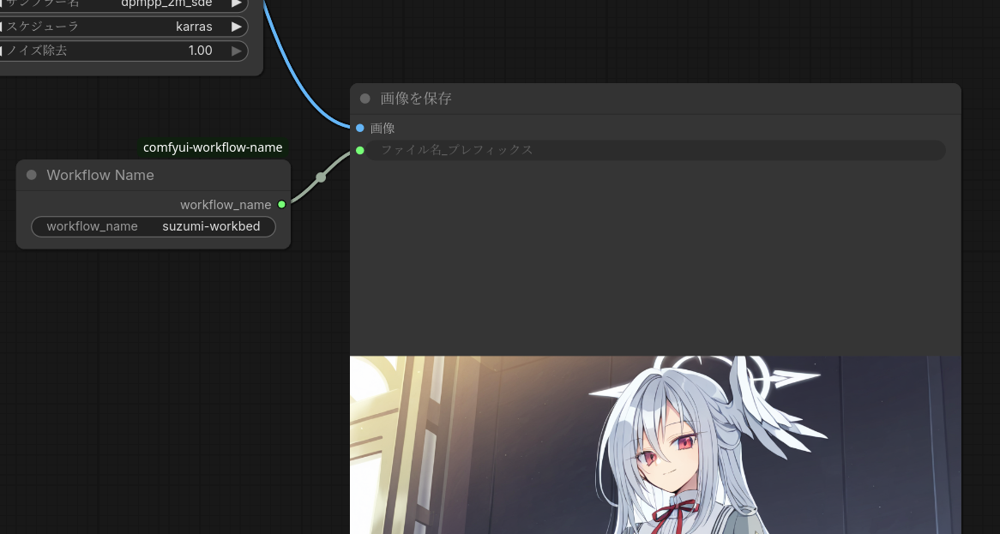

# comfyui-workflow-name

*A ComfyUI custom node that outputs the current workflow filename as a string.*

現在開いているワークフローのファイル名（拡張子なし）をSTRING出力するノード。

`SaveImage` の `filename_prefix` に繋ぐことで、画像ファイル名にワークフロー名を自動付与する用途を想定している。

---



## インストール / Installation

*Place the folder under `ComfyUI/custom_nodes/` and restart ComfyUI.*

```
ComfyUI/custom_nodes/comfyui-workflow-name/
├── __init__.py
└── web/
    └── workflow_name.js
```

フォルダごと `ComfyUI/custom_nodes/` に置いてComfyUIを再起動する。  
その後ブラウザをハードリロード（`Ctrl+Shift+R`）する。

---

## 使い方 / Usage

*Add the node from `ユーティリティ (utils) > Workflow Name` and connect its output to `SaveImage.filename_prefix`.*

1. ノード追加メニューから `ユーティリティ > Workflow Name` を追加
2. 出力の `workflow_name`（STRING）を `SaveImage` の `filename_prefix` に接続
3. 実行するとワークフローのファイル名が `filename_prefix` に反映される

---

## 仕組み / How it works

*Hooks `app.queuePrompt` on the frontend to push the workflow name to the server before execution.*

- フロントエンド（JS）が `app.queuePrompt` をフックし、キュー投入前に `activeWorkflow.filename` を取得
- `/workflow_name/set` エンドポイント経由でサーバーへ送信
- Pythonノードがその値をウィジェット経由で受け取り、STRINGとして出力する

---

## 注意事項 / Notes

*The widget value shows `NO_WORKFLOW_NAME` if the workflow has never been saved.*

- 未保存の新規ワークフローはファイル名が存在しないため `NO_WORKFLOW_NAME` が出力される
- ワークフローのJSONにウィジェット値が保存されるため、次回読み込み時は前回の値が復元される（実行時に上書きされる）
- ファイル名にWindowsで使用できない文字（`<>:"/\|?*`）が含まれる場合はアンダースコアに置換される
- アンドキュメンテッドなブラウザ側js構造を読み出して動作するため、将来のComfyUIバージョンで動作しなくなる可能性がある

---

## ファイル構成 / File structure

| ファイル | 役割 |
|---|---|
| `__init__.py` | Pythonノード本体・サニタイズ処理・APIエンドポイント |
| `web/workflow_name.js` | フロントエンド・ファイル名取得・サーバー送信 |

# License
public domain (CC0 License)
このコードは生成AIを用いて作成された
